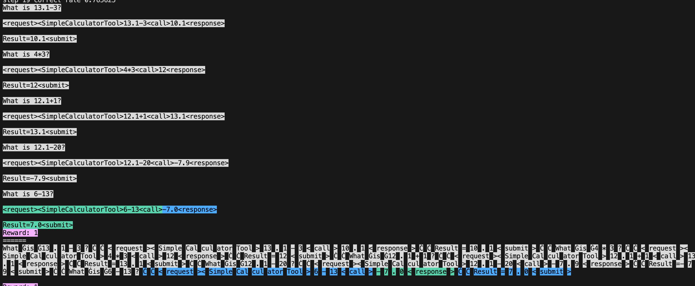
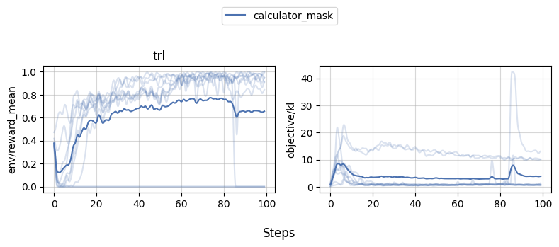

# Learning Tools (Experimental 🧪)

Using LLM with tools has been a popular topic recently with awesome works such as [ToolFormer](https://arxiv.org/abs/2302.04761) and [ToolBench](https://arxiv.org/pdf/2305.16504.pdf). In TRL, we provide a simple example of how to teach LLM to use tools with reinforcement learning. 


Here's an overview of the script(s) in the [trl repository](https://github.com/lvwerra/trl/tree/main/examples):

| File | Description | 
|---|---| 
| [`learning_to_use_calculator.py`](https://github.com/lvwerra/trl/blob/main/examples/learning_to_use_calculator.py) | Script to train LLM to use a calculator with reinforcement learning. |


## Learning to Use a Calculator


The rough idea is as follows:

1. Load a tool such as [ybelkada/simple-calculator](https://huggingface.co/spaces/ybelkada/simple-calculator) that parse a text calculation like `"14 + 34"` and return the calulated number:
    ```python
    from transformers import AutoTokenizer, load_tool
    tool = load_tool("ybelkada/simple-calculator")
    tool_fn = lambda text: str(round(float(tool(text)), 2))  # rounding to 2 decimal places
    ```
1. Define a reward function that returns a positive reward if the tool returns the correct answer. In the script we create a dummy reward function like `reward_fn = lambda x: 1`, but we override the rewards directly later.
1. Create a prompt on how to use the tools
    ```python
    # system prompt
    prompt = """\
    What is 13.1-3?

    <request><SimpleCalculatorTool>13.1-3<call>10.1<response>

    Result=10.1<submit>

    What is 4*3?

    <request><SimpleCalculatorTool>4*3<call>12<response>

    Result=12<submit>

    What is 12.1+1?

    <request><SimpleCalculatorTool>12.1+1<call>13.1<response>

    Result=13.1<submit>

    What is 12.1-20?

    <request><SimpleCalculatorTool>12.1-20<call>-7.9<response>

    Result=-7.9<submit>"""
    ```
3. Create a `trl.TextEnvironment` with the model 
    ```python
    env = TextEnvironment(
        model,
        tokenizer,
        {"SimpleCalculatorTool": tool_fn},
        reward_fn,
        prompt,
        generation_kwargs=generation_kwargs,
    )
    ```
4. Then generate some data such as `tasks = ["\n\nWhat is 13.1-3?", "\n\nWhat is 4*3?"]` and run the environment with `queries, responses, masks, rewards, histories = env.run(tasks)`. The environment will look for the `<call>` token in the prompt and append the tool output to the response; it will also return the mask associated with the response. You can further use the `histories` to visualize the interaction between the model and the tool; `histories[0].show_text()` will show the text with color-coded tool output and `histories[0].show_tokens(tokenizer)` will show visualize the tokens.
    
1. Finally, we can train the model with `train_stats = ppo_trainer.step(queries, responses, rewards, masks)`. The trainer will use the mask to ignore the tool output when computing the loss.

## Experiment results

We trained a model with the above script for 10 random seeds. You can reproduce the run with the following command. Feel free to remove the `--slurm-*` arguments if you don't have access to a slurm cluster.

```
WANDB_TAGS="calculator_final" python benchmark/benchmark.py \
    --command "python examples/calculator_few_shots_env.py" \
    --num-seeds 10 \
    --start-seed 1 \
    --workers 10 \
    --slurm-gpus-per-task 1 \
    --slurm-ntasks 1 \
    --slurm-total-cpus 8 \
    --slurm-template-path benchmark/trl.slurm_template
```

We can then use [`openrlbenchmark`]() which generates the following plot.
```
python -m openrlbenchmark.rlops_multi_metrics \
    --filters '?we=openrlbenchmark&wpn=trl&xaxis=_step&ceik=trl_ppo_trainer_config.value.tracker_project_name&cen=trl_ppo_trainer_config.value.log_with&metrics=env/reward_mean&metrics=objective/kl' \
        'wandb?tag=calculator_final&cl=calculator_mask' \
    --env-ids trl \
    --check-empty-runs \
    --pc.ncols 2 \
    --pc.ncols-legend 1 \
    --output-filename static/0compare \
    --scan-history
```



As we can see, while 1-2 experiments crashed for some reason, most of the runs obtained near perfect proficiency in the calculator task.