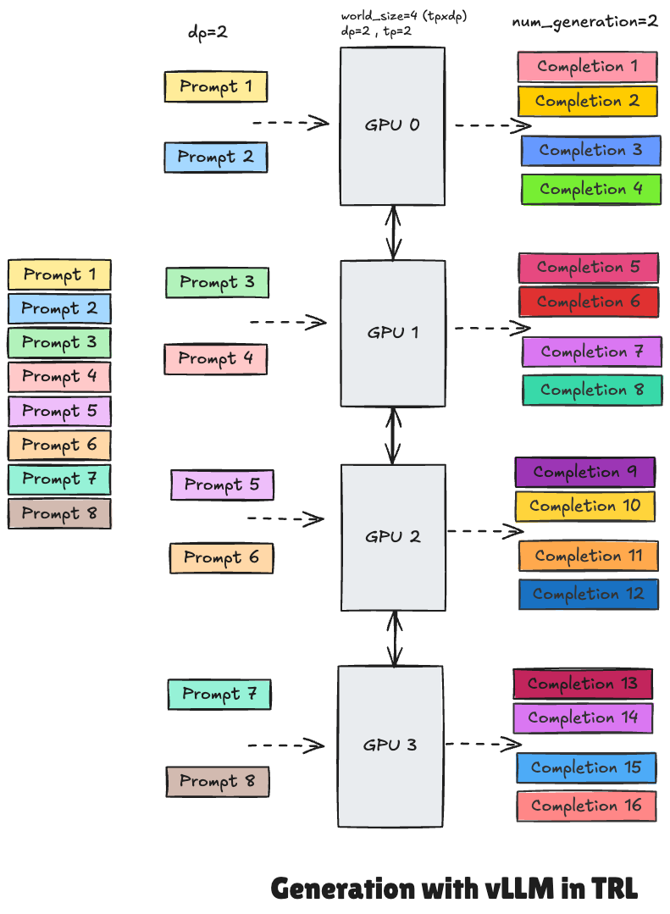

# 🚀 Speeding Up Training TRL x vLLM 

# 🎬 Flashback: why do we need to use vLLM in online methods?

Online methods such as GRPO or Online DPO require the model to generate completions. Because these completions are used to compute the reward signal, they need to be generated at regular intervals during training. This is typically done every `gradient_accumulation_steps * num_iterations` steps, where `num_iterations` is the number of iterations between two gradient updates. Now, the problem is that generating completions is a time-consuming process, especially when using large models. The reason of the time-consuming nature of the generation process is by default, this is done using the [(unwrapped)model's `generate` method](https://github.com/huggingface/trl/blob/f3e8c2304428ef16e9ae5de9e5741ed84d533b7b/trl/trainer/grpo_trainer.py#L965C39-L965C66), (ofcourse if `use_vllm` is set to False). This `unwrapped_model.generate` method is thechnically a synchronous function, meaning that it will block the execution of the program until the generation is complete. This can lead to inefficiencies, especially when generating large batches of completions or when using large models. Therefore, the generation process can become a bottleneck in the training process, leading to longer training times and reduced efficiency. So this is why we need to think of a better way to do this which is using vLLM for faster generation. 

# 🤔 How does vLLM solve the slow generation issue?
if you've ever done autoregressive decoder training, you know  all the input tokens to the LLM produce their attention key and value tensors, and these tensors are kept in GPU memory to later generate next tokens (Q) based on them. These cached key and value tensors are often referred to as KV cache.  However, this storing is really a pain as it occupies a lot of memory. 
So here is the secret sauce of vLLM, it uses a technique called PagedAttention to solve this problem. PagedAttention , which is inspired by the OS’s virtual memory concept stores continuous keys and values in **non-contiguous memory space** which is way more efficient. The detail of this is beyond the scope of this document, but in short, it allows the model to store the keys and values in a more efficient way, reducing the memory footprint and speeding up the generation process. If you are interested, make sure to check out the [vLLM PagedAttention](https://blog.vllm.ai/2023/06/20/vllm.html) for more details.


# ⚙️ How to use vLLM in practice for generation in online methods in TRL?

1. To use [vLLM](https://github.com/vllm-project/vllm), first install it using:

```bash
pip install vllm
```

or 

```bash
pip install "trl[vllm]"
```

<hfoptions id="vllm examples">
<hfoption id="Online DPO">

</hfoption>
<hfoption id="GRPO">

2. Then, **start a vLLM server** by running:

```bash
trl vllm-serve --model <model_name>
```
# 🔎 What exactly happens when you run `trl vllm-serve --model <model_name>`?
when you run for example `CUDA_VISIBLE_DEVICES=0,1,2,3 trl vllm-serve --model Qwen/Qwen2.5-7B --tensor-parallel-size 2 --data-parallel-size 2`, the following happens:

1. First it will spawn multiple workers to handle loads of requests in parallel. To figure our exactly how many workers to spawn, it will use the `--tensor-parallel-size` and `--data-parallel-size` arguments in the command. For example, if you run `CUDA_VISIBLE_DEVICES=0,1,2,3 trl vllm-serve --model Qwen/Qwen2.5-7B --tensor-parallel-size 2 --data-parallel-size 2`, it will spawn 4 workers (2 for data parallelism and 2 for tensor parallelism). Tricky point here is that you need to think of it as 4 workers independent and in parallel at the same time are processing a chunk of the incoming requests. Here the requests are basically the prompts that are sent to the model on the server to generate completions. Therefore, each of these workers(gpus) will be responsible for processing a chunk of the incoming requests. 

2. Now that we have the requests(prompts) ready on each of the workers, the model will start generating the completions. Note that the model (models' weights actually) itself is split across multiple gpus on the vllm side (`--tensor parallelism size`) and each gpu will be responsible for processing a chunk of the incoming requests(`--data parallelism size`).

3. Although the gpus process the requests in parallel and independent of one another, they need to communicate or talk with each other. Because recall that each of them process a chunk of the incoming prompt (e.g. if you have 4 gpus and 8 requests, with dp=2, each gpu will process 2 requests). This  gpu-gpu communication is handled by Nvidia NCCL lib. This communication is just to make sure each gpu has its slice of prompt/request.  Note that you can define the num_generations, as the number of completions to generate for each request. So if you have 4 gpus and 8 requests/prompts, with dp=2 and num_generations=2, each gpu will process 2 prompts and generate 2 completions for each of them. So in total, you will have 16 completions. 

4. **🔬 How it works in practice in trl/grpo?**
  - vLLM server starts running by the command `CUDA_VISIBLE_DEVICES=0,1,2,3 trl vllm-serve --model Qwen/Qwen2.5-7B`
  - Server will do the completion generation by the request from the client(trainer),`vllm_client.generate` [here](https://github.com/huggingface/trl/blob/89556c8cbf1a816539167a46cdf285419e057fec/trl/trainer/grpo_trainer.py#L942) once the completion generation is done on server side
  - Client(trainer) will request completions from the server
  - These completions will further be used to compute the reward signal
  - Then the loss will be computed based on the reward signal and the model's output and finally the backward pass will be done to update the model's weights.
  - Note that the backward pass is done on the trainer side, not on the server side. This is because the server is only responsible for generating completions and not for training the model.  Therefore, the model's weights are not updated on the server side. Therefore the client(trainer) will send the updated weights to the server after the backward pass is done. This is done by calling `vllm_client.update_named_param(name, param.data)`
  

## 📝 Important notes:
When using vLLM, ensure the gpus assigned for training and generation are separate to avoid resource conflicts. For instance, if you plan to use 4 GPUs for training and another 4 for vLLM generation, you can specify GPU allocation using `CUDA_VISIBLE_DEVICES`.  See the example below;

- **Set GPUs **0-3** for vLLM generation:**  
```sh
CUDA_VISIBLE_DEVICES=0,1,2,3 trl vllm-serve --model <model_name>
```  

- **And GPUs **4-7** for training:**  
```sh
CUDA_VISIBLE_DEVICES=4,5,6,7 accelerate launch train.py
```  

## 🍷 More customization options with vLLM?
You can customize the server configuration by passing additional arguments.

```sh
$ trl vllm-serve --help
usage: trl vllm-serve [-h] --model MODEL [--revision REVISION] [--tensor_parallel_size TENSOR_PARALLEL_SIZE] [--host HOST]
                      [--port PORT] [--gpu_memory_utilization GPU_MEMORY_UTILIZATION] [--dtype DTYPE]
                      [--max_model_len MAX_MODEL_LEN] [--enable_prefix_caching ENABLE_PREFIX_CACHING]

options:
  -h, --help            Show this help message and exit
  --model MODEL         Model name or path to load the model from. (default: None)
  --revision REVISION   Revision to use for the model. If not specified, the default branch will be used. (default: None)
  --tensor_parallel_size TENSOR_PARALLEL_SIZE, --tensor-parallel-size TENSOR_PARALLEL_SIZE
                        Number of tensor parallel workers to use. (default: 1)
  --host HOST           Host address to run the server on. (default: 0.0.0.0)
  --port PORT           Port to run the server on. (default: 8000)
  --gpu_memory_utilization GPU_MEMORY_UTILIZATION, --gpu-memory-utilization GPU_MEMORY_UTILIZATION
                        Ratio (between 0 and 1) of GPU memory to reserve for the model weights, activations, and KV cache on the device
                        dedicated to generation powered by vLLM. Higher values will increase the KV cache size and thus improve the
                        model's throughput. However, if the value is too high, it may cause out-of-memory (OOM) errors during
                        initialization. (default: 0.9)
  --dtype DTYPE         Data type to use for vLLM generation. If set to 'auto', the data type will be automatically determined based on
                        the model configuration. Find the supported values in the vLLM documentation. (default: auto)
  --max_model_len MAX_MODEL_LEN, --max-model-len MAX_MODEL_LEN
                        If set, the `max_model_len` to use for vLLM. This can be useful when running with reduced
                        `vllm_gpu_memory_utilization`, leading to a reduced KV cache size. If not set, vLLM will use the model context
                        size, which might be much larger than the KV cache, leading to inefficiencies. (default: None)
  --enable_prefix_caching ENABLE_PREFIX_CACHING, --enable-prefix-caching ENABLE_PREFIX_CACHING
                        Whether to enable prefix caching in vLLM. If set to `True`, ensure that the model and the hardware support this
                        feature. (default: None)
```

# 🥸 Okay, now that we have the server running, how can we use it to generate completions? 

Then, run the training script and pass `use_vllm=True` in the training arguments.

```python
from trl import GRPOConfig

training_args = GRPOConfig(..., use_vllm=True)
```

# 🫠 TL;DR 
First run the server by; (this example allocate 4 GPUs for vLLM generation)
```sh
CUDA_VISIBLE_DEVICES=0,1,2,3 trl vllm-serve --model Qwen/Qwen2.5-7B
```  
Then, run the training script by passing `use_vllm=True` in the training arguments (this example allocate 4 GPUs for training) by;
  
```sh
CUDA_VISIBLE_DEVICES=4,5,6,7 accelerate launch train.py
```  

Sample of a simple `train.py` script:

```python
from datasets import load_dataset
from trl import GRPOTrainer, GRPOConfig

dataset = load_dataset("trl-lib/tldr", split="train")


# Dummy reward function: count the number of unique characters in the completions
def reward_num_unique_chars(completions, **kwargs):
    return [len(set(c)) for c in completions]


training_args = GRPOConfig(
    output_dir="my_test",
    use_vllm=True,
    bf16=True,
    gradient_checkpointing=True,
    logging_steps=10,
)

trainer = GRPOTrainer(
    model="Qwen/Qwen2.5-7B",
    args=training_args,
    reward_funcs=reward_num_unique_chars,
    train_dataset=dataset,
)
trainer.train()
```


</hfoption>
</hfoptions>
