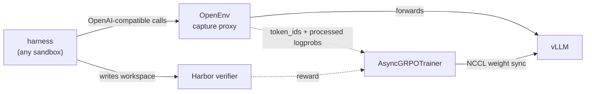

<!-- PR description for examples/async_grpo_harbor. Scaffolding — delete before pushing, or keep it
     untracked. -->

Adds an AsyncGRPO example that trains against any [Harbor](https://www.harborframework.com) task suite served through **[OpenEnv](https://github.com/huggingface/OpenEnv)**.

The shape is: **pick a Harbor dataset, pick a sandbox, pick a harness, and train.** All three are per-rollout choices against one long-lived OpenEnv server — so switching harness or sandbox is an argument, not a rebuild, and the same server serves training and evaluation at the same time.

```python
HarborSessionFactory(
    server,                    # one OpenEnv server owns the dataset + sandbox templates
    split="<any Harbor suite>",
    sandbox="<any backend>",   # e2b, docker, daytona, modal, gke, ...
    harness="<any harness>",   # any agent the server reports as validated
    llm_url=vllm_url,          # the engine is chosen PER ROLLOUT
    model=model,
)
```

This is the case [#6018](https://github.com/huggingface/trl/pull/6018) explicitly left out. That PR supported Harbor's *external* agents only, because "RL needs the trainer to drive generation turn-by-turn and capture the policy's tokens/log-probs + env mask — which an opaque in-container agent can't expose." OpenEnv's capture proxy exposes exactly that, so **installed agents that own their own loop become trainable without reimplementing them**.



The harness owns its loop; TRL never calls `step()`. It stands up an endpoint, lets the agent drive, and reads back what happened. Because the agent's calls and the trainer's weight updates go to the **same** vLLM, rollouts stay on-policy — and OpenEnv decides the tier by probing that engine: token ids plus processed logprobs mean `train`; anything less means `eval`, and the session yields no trainable turns rather than rows of zeros.

Nothing is added to TRL. Everything Harbor-specific lives in OpenEnv (`harbor_env.harness`), so the example file is the whole integration.

## Usage

```sh
# 1. One OpenEnv server owns the dataset and the sandbox templates. Long-lived: the engine is named
#    per rollout, so changing engines needs no restart.
openenv harbor serve --dataset <hf-dataset> --port 8200 --capture-port 8300 --expose gradio

# 2. Serve the policy. The token-id and logprob flags are load-bearing, not optional.
CUDA_VISIBLE_DEVICES=0 VLLM_SERVER_DEV_MODE=1 vllm serve Qwen/Qwen3.5-2B \
    --enable-auto-tool-choice --tool-call-parser qwen3_xml --reasoning-parser qwen3 \
    --default-chat-template-kwargs '{"enable_thinking": false}' \
    --logprobs-mode processed_logprobs --return-tokens-as-token-ids \
    --weight-transfer-config '{"backend":"nccl"}'

# 3. Train.
CUDA_VISIBLE_DEVICES=1 python examples/async_grpo_harbor/async_grpo_harbor.py \
    --server http://localhost:8200 --vllm-url http://localhost:8000 \
    --model Qwen/Qwen3.5-2B --split <hf-dataset> --max-steps 20
```

## Defaults, and why they are the defaults

`--harness mini-swe-agent --sandbox e2b`. Any harness the server reports works, but two properties decide which one to *train* on, and they were measured across a 15-harness sweep on the same 50 tasks:

- **Prompt re-render must be byte-exact** against the engine's own `prompt_token_ids`. TRL rebuilds each prompt locally because `TraceEntry` carries no prompt ids, and for three of twelve harnesses measured that drifts — `claude-code` +2 tokens, `gemini-cli` +2, `kimi-cli` −10 per tool call. Invisible for eval; forks the trajectory *every turn* when training.
- **A step limit must be expressible.** Every turn re-sends the whole conversation, so a rollout's packed length grows with the **square** of its turn count; unbounded 58-turn rollouts were enough to OOM the loss step on an 80 GiB card. `mini-swe-agent` is the one harness that honours a limit.

## Depends on

**[huggingface/OpenEnv#1036](https://github.com/huggingface/OpenEnv/pull/1036)**, which adds `envs/harbor_env` and the capture layer this example is built on. The PEP 723 header references it by git subdirectory, so the example is not installable until that lands.
